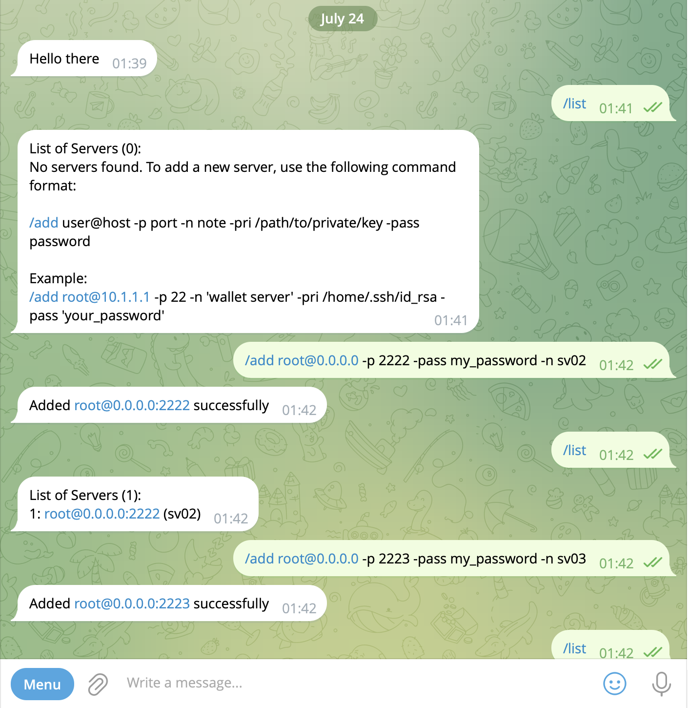
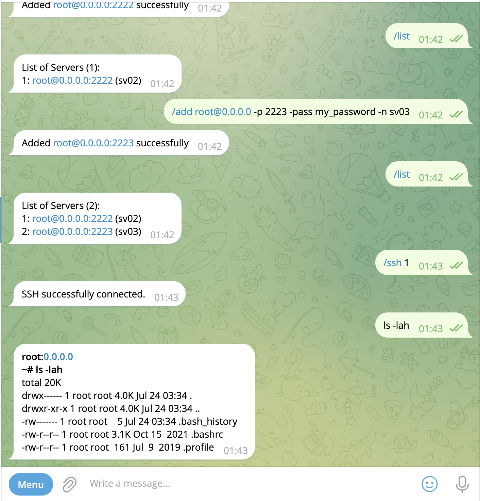
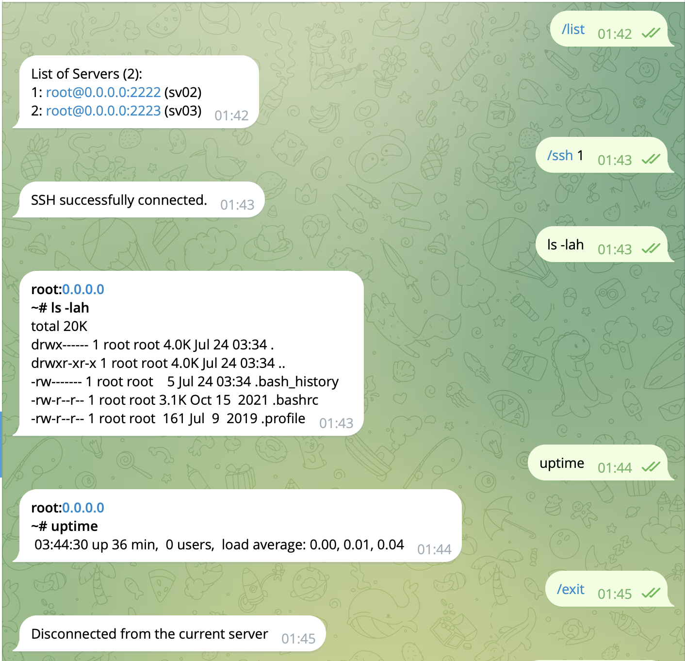

# telegram-ssh

A simple SSH manager and client for your servers, integrated with Telegram for easy control and monitoring.

## Features

- **Manage Servers**: Add, list, and remove servers.
- **SSH Connection**: Connect and execute commands on your servers via SSH.
- **Telegram Integration**: Interact with your servers through Telegram commands.

## Command-Line Options

- **`--bot_token`, `-b`**: The Telegram bot token used for authentication with the Telegram API. This is required to interact with the Telegram bot.

  - Example: `--bot_token "123456789:ABCdefGHIjklMNO_pQRstuVWxyZ"`

- **`--chat_id`, `-c`**: The Telegram chat ID where the bot will send messages. This is the chat where you'll interact with the bot.

  - Example: `--chat_id "987654321"`

- **`--owner_ids`, `-o`**: Comma-separated list of owner chat IDs who have control over the bot. Only these users can execute bot commands.

  - Example: `--owner_ids "111111111,222222222"`

- **`--path_privatekey`, `-p`**: Path to the SSH private key file used to authenticate with your servers. Ensure this key matches the public key configured on your servers.

  - Example: `--path_privatekey "/home/user/.ssh/id_rsa"`

- **`--servers_file`, `-s`**: Path to the JSON file that contains the details of your servers. This file should be in the format expected by the bot.
  - Example: `--servers_file "/path/to/servers.json"`

## Setup

1. **SSH Keys**: Ensure your SSH keys are set up on each server you want to connect to.

2. **Configuration**:

   - Make sure Node.js and npm are installed.
   - Run `npm install` to install the required dependencies.

3. **Run**:

   - Start the bot with the following command:

     ```bash
     node bot.js --bot_token "your-telegram-bot-token" --chat_id "your-chat-id" --owner_ids "comma-separated-owner-ids" --path_privatekey "/path/to/your/private/key" --servers_file "/path/to/servers.json"
     ```

   - Alternatively, use `pm2` for process management:

     ```bash
     pm2 start bot.js --name telegram-ssh -- --bot_token "your-telegram-bot-token" --chat_id "your-chat-id" --owner_ids "comma-separated-owner-ids" --path_privatekey "/path/to/your/private/key" --servers_file "/path/to/servers.json"
     ```

## Bot Commands

- **`/ssh (index | user@host)`**: Connect to a server by its index or user@host.
- **`/list`**: Display the list of servers.
- **`/current`**: Show the currently connected server.
- **`/add (user@host -p port -pass password -n note -pri /path/to/private/key -keypass keypassword)`**: Add a new server with the specified details.
- **`/rm (index | user@host)`**: Remove a server by its index or user@host.
- **`/exit`**: Disconnect from the current server.

## Demo

### Setup servers

```
docker pull takeyamajp/ubuntu-sshd
docker run -d -p 2222:22 --name ubuntu-server02 -e ROOT_PASSWORD="my_password" takeyamajp/ubuntu-sshd
docker run -d -p 2223:22 --name ubuntu-server03 -e ROOT_PASSWORD="my_password" takeyamajp/ubuntu-sshd

```

### Images





## TODO

- [x] Add detailed descriptions for each server entry (host, username, password, port, pathPrivateKey, note).
- [x] Support for custom ports.
- [ ] Build to binary executable for simple setup (no need nodejs installed)
- [ ] Implement `try-catch` blocks for SSH failures.
- [ ] Automatically close sessions after a period of inactivity.

---
