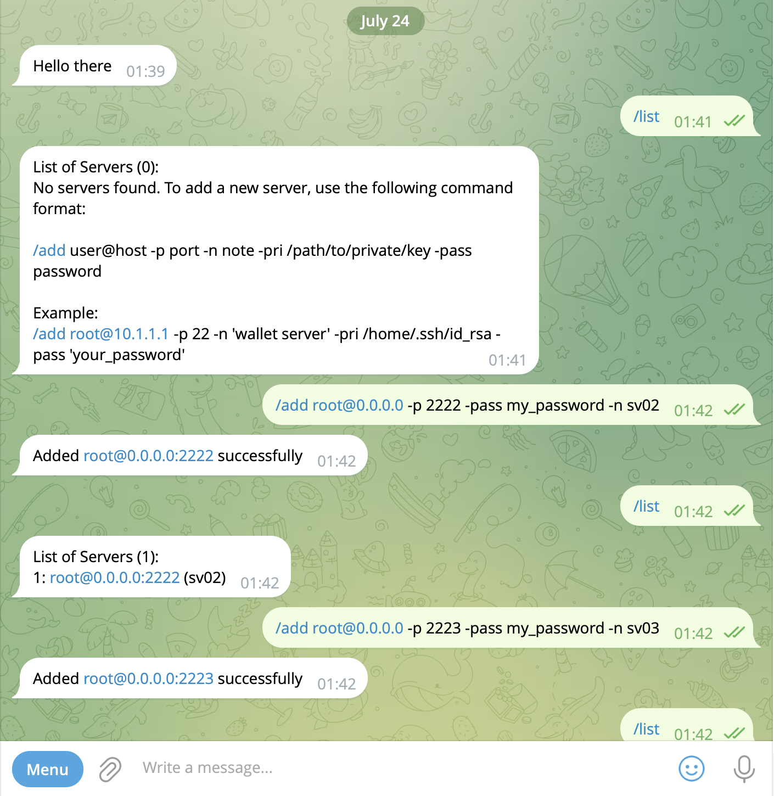
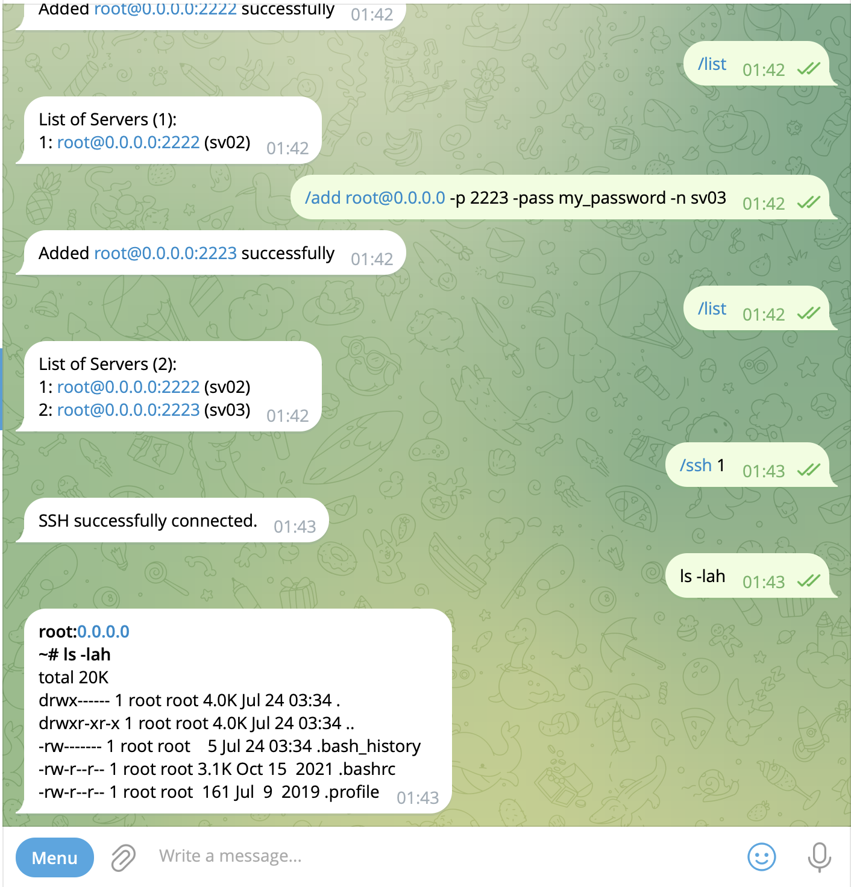
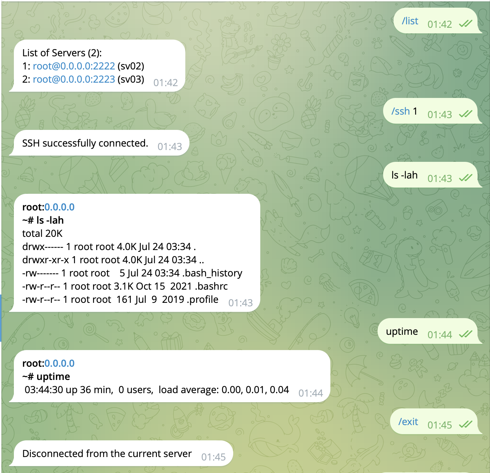

# telegram-ssh

A simple SSH manager and client for your servers, integrated with Telegram for easy control and monitoring.

## Features

- **Manage Servers**: Add, list, and remove servers.
- **SSH Connection**: Connect and execute commands on your servers via SSH.
- **Telegram Integration**: Interact with your servers through Telegram commands.

## Configuration Options

The bot can be configured via command-line arguments or environment variables:

| CLI Argument | Environment Variable | Description | Required |
|-------------|---------------------|-------------|----------|
| `--bot_token`, `-b` | `BOT_TOKEN` | Telegram bot token | Yes |
| `--chat_id`, `-c` | `CHAT_ID` | Telegram chat ID | Yes |
| `--owner_ids`, `-o` | `OWNER_IDS` | Comma-separated owner chat IDs | Yes |
| `--path_privatekey`, `-p` | `PATH_PRIVATEKEY` | Path to SSH private key | Yes |
| `--servers_file`, `-s` | `SERVERS_FILE` | Path to servers JSON file | No (default: `/var/telegram-ssh/servers.json`) |

## Setup

### Option 1: Docker (Recommended)

1. **Prerequisites**: Make sure Docker and Docker Compose are installed.

2. **Configuration**:
   
   - Copy the example environment file and edit it with your values:
     ```bash
     cp .env.example .env
     # Edit .env with your bot token, chat ID, and owner IDs
     ```
   
   - Create directories for SSH keys and data:
     ```bash
     mkdir -p keys data
     ```
   
   - Copy your SSH private key to the keys directory:
     ```bash
     cp /path/to/your/private/key keys/id_rsa
     chmod 600 keys/id_rsa
     ```

3. **Run with Docker Compose**:
   
   ```bash
   # Using .env file
   docker-compose up -d
   
   # Or specify environment variables directly
   BOT_TOKEN="your-token" CHAT_ID="your-chat-id" OWNER_IDS="owner1,owner2" docker-compose up -d
   ```

4. **Alternative Docker run**:
   
   ```bash
   # Build the image
   docker build -t telegram-ssh .
   
   # Run the container
   docker run -d \
     --name telegram-ssh \
     --restart unless-stopped \
     -e BOT_TOKEN="your-telegram-bot-token" \
     -e CHAT_ID="your-chat-id" \
     -e OWNER_IDS="comma-separated-owner-ids" \
     -e PATH_PRIVATEKEY="/app/keys/id_rsa" \
     -e SERVERS_FILE="/var/telegram-ssh/servers.json" \
     -v ./keys:/app/keys:ro \
     -v ./data:/var/telegram-ssh \
     telegram-ssh
   ```

5. **View logs**:
   ```bash
   docker-compose logs -f telegram-ssh
   ```

### Option 2: Direct Node.js

1. **SSH Keys**: Ensure your SSH keys are set up on each server you want to connect to.

2. **Configuration**:

   - Make sure Node.js and npm are installed.
   - Run `npm install` to install the required dependencies.

3. **Run**:

   - Start the bot with the following command:

     ```bash
     node bot.js --bot_token "your-telegram-bot-token" --chat_id "your-chat-id" --owner_ids "comma-separated-owner-ids" --path_privatekey "/path/to/your/private/key" --servers_file "/path/to/servers.json"
     ```

   - Alternatively, use `pm2` for process management:

     ```bash
     pm2 start bot.js --name telegram-ssh -- --bot_token "your-telegram-bot-token" --chat_id "your-chat-id" --owner_ids "comma-separated-owner-ids" --path_privatekey "/path/to/your/private/key" --servers_file "/path/to/servers.json"
     ```

## Bot Commands

- **`/ssh (index | user@host)`**: Connect to a server by its index or user@host.
- **`/list`**: Display the list of servers.
- **`/current`**: Show the currently connected server.
- **`/add (user@host -p port -pass password -n note -pri /path/to/private/key -keypass keypassword)`**: Add a new server with the specified details.
- **`/rm (index | user@host)`**: Remove a server by its index or user@host.
- **`/exit`**: Disconnect from the current server.

## Demo

### Setup servers

```
docker pull takeyamajp/ubuntu-sshd
docker run -d -p 2222:22 --name ubuntu-server02 -e ROOT_PASSWORD="my_password" takeyamajp/ubuntu-sshd
docker run -d -p 2223:22 --name ubuntu-server03 -e ROOT_PASSWORD="my_password" takeyamajp/ubuntu-sshd

```

### Images





## TODO

- [x] Add detailed descriptions for each server entry (host, username, password, port, pathPrivateKey, note).
- [x] Support for custom ports.
- [ ] Build to binary executable for simple setup (no need nodejs installed)
- [ ] Implement `try-catch` blocks for SSH failures.
- [ ] Automatically close sessions after a period of inactivity.

## Troubleshooting

### Docker Issues

- **Module not found errors**: Ensure your Docker build completed successfully and all dependencies were installed.
- **Permission denied on SSH keys**: Make sure your SSH key file has proper permissions (`chmod 600 keys/id_rsa`).
- **Volume mount issues**: Verify that the `./keys` and `./data` directories exist and have correct permissions.

### General Issues

- **Bot not responding**: Check that your `BOT_TOKEN` is valid and the bot is added to your chat.
- **SSH connection fails**: Verify that your SSH key is properly configured on the target servers.
- **Permission denied**: Ensure your `OWNER_IDS` includes your Telegram user ID.

### Getting Help

Check the logs for detailed error messages:
```bash
# For Docker Compose
docker compose logs -f telegram-ssh

# For direct Docker run
docker logs telegram-ssh
```

---
